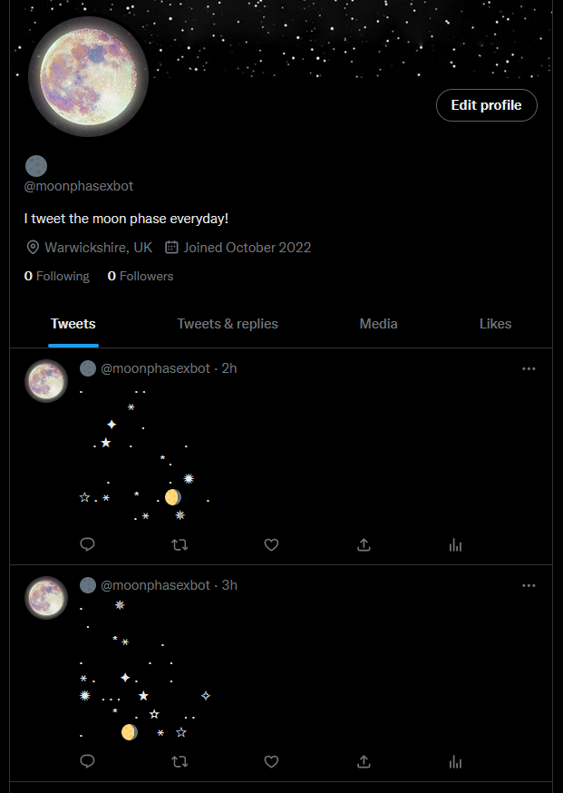

# Moon Phase Twitter Bot

A Twitter bot using Node.js and Heroku to tweet the moon phase daily. The unicode for the current moon phase is placed in a randomly gernerated, unicode-drawn starry sky. The bot's location is configurable, but currently set to London, UK.

